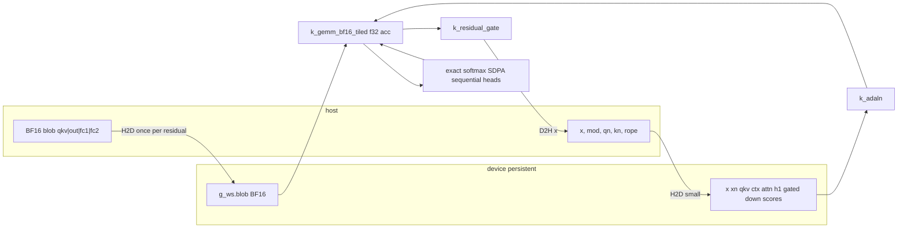

# H3 AdaLN Streaming + CUDA DiT Residual Optimization

| Field | Value |
| --- | --- |
| Author | TBD |
| Date | 2026-09-14 |
| Status | Landed (stream + tiled GEMM); 3-mod AdaLN + CUDA SDPA follow-up in tree |
| Scope | `H3Engine` AdaLN host load + `h3_cuda::dit_residual` device path |
| Out of scope | residual-gate GEMM epilogue, `set_rope` (optional) |
| Baseline | `f1cef47` (H3 CUDA DiT, streamed Qwen text encoder, prepare/run scripts) |

## Overview

Official MiniMax-H3 cannot run a real 50-layer AdaLN video pass on a 62–64 GiB host: `H3Engine::bind_transformer` in `src/model/h3.cpp` materializes every `blocks.N.adaln_proj.linear.weight` as f32 (`adaln_w_`). Inferred official `W` is `[3·6·5376, 2688]` = `96768×2688` BF16 (`520,224,768` B = **496.125 MiB = 0.484 GiB**); 50 × f32 is `52,022,476,800` B = **48.45 GiB**. `MVLLM_H3_ADALN_MAX` is a workaround that simply drops later layers. The same generate loop then calls `h3_cuda::dit_residual` (`src/gpu/h3_cuda.cu` `h3_cuda_dit_residual_dev`), which `cudaMalloc`/`cudaFree`s ~15 buffers every residual, uploads the BF16 DiT blob (`770,703,360` B = **735.0 MiB**), converts all four weights to f32, and runs a one-thread-per-output `k_gemm_f32`. Official 64×64 / 8 frames / 2 steps / 4 AdaLN layers is ~2 min on an RTX 5090; 50 layers will not be usable.

This design copies the already-landed text-encoder stream (`H3TextEncoder` in `src/model/h3_text.cpp`): keep `io::StFile` fds open, record `StHit`s **after** `files_ = std::move(files)`, materialize one AdaLN **prefix** `W` at use, free it after `mod` is built. Bias stays resident. Default (unset) is stream-all; `MVLLM_H3_ADALN_MAX=0` keeps its old meaning (skip all AdaLN); `MAX=N>0` is N resident + rest stream; `MVLLM_H3_ADALN_RESIDENT=1` wins and is the golden/debug resident-all path. Independently, the CUDA residual keeps the `h3_dit_block_cpu` numerical contract (`tests/test_host.cpp` `test_h3_cuda_dit`, abs 2e-4 / 3e-4) but allocates a persistent device workspace and replaces naive `k_gemm_f32` with a tiled shared-memory GEMM from BF16 weights (f32 accumulate). No cuBLAS is added to `mvllm_host` (it links `CUDA::cudart` only). Generate dispatch stays **CUDA-then-Metal-then-CPU**.

## Background & Motivation

### Current AdaLN load

`bind_transformer` (`src/model/h3.cpp` ~961–1098) opens the transformer dir with `io::st_open_dir`, registers the four DiT matrices through `BlockStore` (`attn.qkv_proj` / `attn.out_proj` / `mlp.fc1` / `mlp.fc2`, suffixes in `kH3StreamSuffix`), then `load_f`s small tensors via `io::st_read_f32` and **closes the fds**:

```1071:1093:src/model/h3.cpp
        adaln_w_.assign(static_cast<size_t>(n_blocks), {});
        adaln_b_.assign(static_cast<size_t>(n_blocks), {});
        q_norm_.assign(static_cast<size_t>(n_blocks), {});
        k_norm_.assign(static_cast<size_t>(n_blocks), {});
        // Official AdaLN is ~0.52 GiB BF16 / layer. Materializing all 50 as f32
        // is ~52 GiB and OOMs a 64 GiB host. MVLLM_H3_ADALN_MAX caps how many
        // layers we convert; q/k norms stay cheap and always load.
        int adaln_max = n_blocks;
        if (const char *e = std::getenv("MVLLM_H3_ADALN_MAX")) {
            const int v = std::atoi(e);
            if (v >= 0)
                adaln_max = v < n_blocks ? v : n_blocks;
        }
        for (int i = 0; i < n_blocks; ++i) {
            const std::string p = "blocks." + std::to_string(i) + ".";
            if (i < adaln_max) {
                load_f(p + "adaln_proj.linear.weight", adaln_w_[static_cast<size_t>(i)]);
                load_f(p + "adaln_proj.linear.bias", adaln_b_[static_cast<size_t>(i)]);
            }
            load_f(p + "attn.q_norm.weight", q_norm_[static_cast<size_t>(i)]);
            load_f(p + "attn.k_norm.weight", k_norm_[static_cast<size_t>(i)]);
        }
        io::st_close_dir(files);
```

Inferred official shapes (`H3Config` in `src/core/config.hpp`, `h3_adaln.hpp`). No official safetensors header is in this workspace; sizes below are exact products of those defaults. Bind must **validate rank/shape** rather than assume `[96768, 2688]`.

| Tensor | Shape (inferred) | Bytes | MiB (1024²) | GiB (1024³) |
| --- | --- | --- | --- | --- |
| `adaln_proj.linear.weight` BF16 | `[3·6·5376, 2688]` = `[96768, 2688]` | `96768×2688×2 = 520,224,768` | 496.125 | 0.484 |
| same, f32 | | `1,040,449,536` | 992.250 | 0.969 |
| 50 × weight f32 | | `52,022,476,800` | | **48.45** |
| `adaln_proj.linear.bias` f32 | `[96768]` | `387,072` | 0.369 | |
| 50 × bias f32 | | `19,353,600` | 18.46 | |
| Q/K norm `[128]` × 50 × 2 f32 | | `51,200` | 0.049 | |

`h3_adaln_out(hidden) = 3 * 6 * hidden` (`kH3AdalnModalities * kH3AdalnSlots`). Generate, however, only consumes the **first modality** (`mrows = 6 * hidden` at `h3.cpp:664`). That is the live contract this work preserves. Prefix of first `6·5376` rows: `32256×2688×2 = 173,408,256` B = **165.375 MiB** BF16 / **330.750 MiB** f32.

### Current generate AdaLN use

Per denoise step, per layer (`h3.cpp` ~644–689):

1. Time features (`h3_time_features`) → SiLU MLP on `time_in_*` / `time_out_*` → `temb[td]`.
2. `mod[6H] = adaln_w[b] @ temb + adaln_b[b]` via `quant::matmul_f32` (`W` is `[O,I]` row-major, `y[S,O] = x[S,I] @ W[O,I]^T`).
3. Dispatch (must stay in this order):

```680:694:src/model/h3.cpp
                        if (gpu::device() == Device::Cuda)
                            ran = h3_cuda::dit_residual(...);
                        if (!ran)
                            ran = metal_h3::dit_residual(...);
                        if (!ran)
                            h3_dit_block_cpu(...);
```

`metal_h3` CPU stub (`src/gpu/metal_h3.cpp:21–35`) has `available()==true` and `dit_residual` always runs `h3_dit_block_cpu` and returns `true`. `h3_cuda::dit_residual` also falls back to CPU and returns `true`. Therefore generate **must** try CUDA first when `gpu::device()==Device::Cuda`, and must **not** use `metal_h3::available()` as a CUDA gate. Empty `mod` → `nullptr` → identity AdaLN (RMS only, gate = 1).

Time widths are **not** inferred from tensors. `H3Config::time_input` defaults to 256 (`src/core/config.hpp:98`); `bind_transformer` never overwrites it. Generate does:

```
tin = tdim = cfg_.h3.time_input  // 256
th  = time_in_w_.size() / tin
td  = time_out_w_.size() / th
```

A fixture with `time_in = [8, 8]` yields `th = 0` and never builds `mod`. Engine tests must size `time_in` as `[th, 256]`.

The time MLP is identical for every layer of a step and is currently recomputed inside the layer loop, **only when that layer has AdaLN and both time weights are non-empty**. `h3_time_embed` in `h3_adaln.cpp` applies **two** SiLUs; the generate inline applies **one** (after `time_in` only). This design **does not** switch generate onto `h3_time_embed`. It hoists the existing one-SiLU inline **only if** time weights exist and AdaLN mode is not Off / Skip.

### Current CUDA residual

`h3_cuda_dit_residual_dev` (`src/gpu/h3_cuda.cu:210`) every call:

- ~15 `dalloc` / `dfree` pairs (blob, x, xn, four f32 weights, qkv, ctx, attn, h1, gated, down, scores, mod, qn, kn, rope).
- `cudaMemcpy` of the whole host blob (`qkv+out+fc1+fc2`), then four `k_bf16_to_f32` launches.
- `k_gemm_f32`: one thread per `(s,o)`, inner product over `I` with no shared memory. Same kernel exists in `src/gpu/cuda_gemm.cu` for the generic `gpu::Backend`; that backend also mallocs per call and is **not** the H3 generate path (`H3Engine` prefers `h3_cuda::dit_residual` when AdaLN/RoPE are present).
- Sequential `for (h = 0; h < heads; ++h)` SDPA writing `scores[T,T]`.
- Host↔device copy of `x`, `mod`, q/k norm, rope every call.

`mvllm_host` with `-DMVLLM_GPU_CUDA=ON` links **`CUDA::cudart` only** (`CMakeLists.txt:197–201`). `CUDA::cublas` is used solely by the legacy `micro-vllm-cuda` Llama demo. Do not add a cuBLAS dependency to the host engine.

### Existing stream pattern to copy

`H3TextEncoder` (`src/model/h3_text.hpp` / `h3_text.cpp`):

- `files_` (`std::vector<io::StFile>`) kept open; destructor calls `io::st_close_dir`.
- **Move first, then find:** `files_ = std::move(files);` then `st_find_dir(files_, …)` (`h3_text.cpp:257–289`). Hits alias `files_` tensor storage. Never search the caller vector; never resize `files_` after hits.
- `encode()` → `load_layer_mats` reads 7 tensors through `io::st_read_f32` into stack `QuantMat`s, `apply_layer`, locals destroy.
- `MVLLM_H3_TEXT_RESIDENT=1` forces the old fully-resident path for golden compare (`tests/test_host.cpp` ~5131–5144, 1e-5).
- `MVLLM_H3_SKIP_TEXT` / missing dump → `alloc_synth()`. Unchanged by this work.

DiT **block blobs** already stream via `BlockStore::acquire` / `release` / `prefetch_async` (`src/store/block_store.hpp`). `prefetch_async` **joins then spawns** (`block_store.cpp:325–336`). AdaLN is a **separate** safetensors pair, not part of the four-piece blob. AdaLN prefetch copies that join-then-spawn contract and **does not wrap** to layer 0 (BlockStore generate wraps `b+1` to 0; AdaLN must not).

## Goals & Non-Goals

### Goals

- Load all 50 official AdaLN layers on a 62 GiB host without setting `MVLLM_H3_ADALN_MAX` (unset = stream all).
- Never hold more than 1 f32 AdaLN prefix-`W` (2 if prefetch is in flight).
- Preserve generate semantics: missing AdaLN still skips `mod`; `MAX=0` still skips all `mod`; synth / `bytes != expect` path unchanged; `test_h3_checkpoint` (no AdaLN tensors) still streams DiT blocks and notes `CPU DiT`.
- CUDA residual matches `h3_dit_block_cpu` at the existing abs tolerances (`2e-4` AdaLN + T=300, `3e-4` RoPE hd=96). `#if MVLLM_WITH_CUDA_GEMM` still requires `h3_cuda::backend_name() == "cuda"`.
- Persistent device workspace allocated once, grown transactionally if `T/H/I/ffn/blob` increase, freed in `h3_cuda::shutdown`.
- One engineer, two independently testable local commits.

### Non-Goals

- residual-gate GEMM epilogue and `set_rope` (optional).
- Turning `SKIP_TEXT` off and encoding the 32B Qwen stack as part of this work.
- 3-modality AdaLN `row_map` (official `3*6*H` consumed per segment kind). Generate keeps `mrows = 6*H` (first modality). Full 3-mod `mod` is a later generate-layout change.
- Switching generate onto two-SiLU `h3_time_embed`.
- cuBLAS / cuDNN / FlashAttention library.
- Device-side LRU of 50 converted DiT blocks (does not fit 32 GiB; sequential `0..L-1` walk makes a small LRU miss every layer).
- Changing `dit_residual`'s public positional signature.
- Default tests against the official 135G dump (env-gated only, not added here).
- TF32 as the default math mode.
- Batched-head / online SDPA in commit 2 (follow-up). Commit 2 is workspace + tiled GEMM only; sequential per-head exact softmax stays.

## Key Decisions

1. **Keep AdaLN fds open; do not re-open per layer.** Matches `H3TextEncoder`. `pread` on a stable fd is the cheap path; `BlockStore` already holds its own fds for the four DiT pieces, so AdaLN fds are extra but few (one per shard, typically 1–4). Re-open would repeat `st_open` header parse (~MBs of JSON) 50 × steps times.

2. **Stream weight only; keep every bias resident.** Bias is `96768×4 = 387,072` B/layer, `19,353,600` B = 18.46 MiB for 50 layers. Eliminates a second I/O per layer for a rounding-error of RAM. `q_norm_` / `k_norm_` stay fully resident as today. **Resident `W` is prefix-only** (`6·H` rows via `h3_adaln_read_w`), never a full `st_read_f32` of `3·6·H` rows. `RESIDENT=1` on official is `50 × 346,816,512` B = `17,340,825,600` B = **16,537.5 MiB = 16.15 GiB**, not 48.45 GiB.

3. **Read only the first `mrows = 6*H` rows of `W`.** Generate only multiplies the first `6*H` rows (`h3.cpp:664–670`). Official dump is **inferred** as `[3·6·H, td]`; bind does not assume that header. A prefix `pread` of `32256×2688×2 = 173,408,256` B = **165.375 MiB** BF16 (then 330.750 MiB f32) is valid only for C-contiguous `[O,I]` (safetensors default). Bind requires `shape.size()==2`, `shape[0] >= 6*hidden`, and records `cols = shape[1]`. `load_mod` requires `cols == td`. If a fixture tensor is exactly `[6H, td]`, prefix == full read.

4. **Convert BF16 → f32 once per layer use, then `h3_adaln_mod`.** One helper for generate, `load_mod`, and tests. `h3_adaln_mod` is `h3_linear` (`y = x @ W^T + b`, `b` nullable) — same algebra as today's `quant::matmul_f32` + bias add. Do **not** keep a BF16 host `W` and write a host BF16 matmul. Decode is the same shift-16 path `st_read_f32` uses (`src/io/safetensors.cpp:355–360`). Handle BF16 and F32; reject other dtypes.

5. **Env knobs (no silent break of `MAX=0`).**
   - Unset `MVLLM_H3_ADALN_MAX` → stream all usable layers.
   - `MVLLM_H3_ADALN_MAX=0` (and `atoi` of non-numeric, which is 0) → **skip all** AdaLN (old meaning). No `mod`, fds need not stay open.
   - `MVLLM_H3_ADALN_MAX=N` with `N>0` → first `N` layers resident prefix-`W`, remaining usable layers stream.
   - `MVLLM_H3_ADALN_RESIDENT=1` (set and not `"0"`) **wins** over `MAX`: materialize every usable prefix-`W`.
   Unset already means stream-all, so `MAX=0` is the disable path. Old `MAX=4` OOM workaround becomes 4 resident + rest streamed — all usable layers still have real AdaLN.

6. **Prefetch copies the `BlockStore` helper-thread contract.** `prefetch()`: `wait_prefetch()` (join if joinable); if layer is out of range, missing, unusable, or resident, **return** (no spawn, **do not wrap to 0**); else spawn. `load_mod`: `wait_prefetch()` then lock before comparing `(pref_layer_, pref_rows_, pref_cols_)` and moving `pref_w_`. `close()`: `wait_prefetch()` then `st_close_dir(files_)` then `hits_.clear()`. Peak = 2 f32 prefix-`W` (2 × 330.750 MiB = 661.500 MiB). POSIX `pread` on `StFile.fd` is safe concurrent with `BlockStore` preads on different fds.

7. **Hoist the existing one-SiLU time MLP to once per denoise step, only if time weights exist and mode is not Off/Skip.** Empty `time_in_w_` / `time_out_w_` must not divide by zero or allocate `temb` of size 0. If mode is Off/Skip, do not hoist and do not call `load_mod`.

8. **`describe()` grows `adaln=`.** Values: `off` (no usable hits, synth), `skip` (`MAX=0`), `stream`, `resident`, `capped-N`. If some hits exist but fail rank/shape, append `,skip=K` (`K` = unusable hit count), e.g. `adaln=stream,skip=2`. Generate note grows `adaln_mod=on` if any `load_mod` succeeded this call, else `adaln_mod=off` — Engine tests must not pass on identity AdaLN.

9. **CUDA: persistent workspace + GEMM from BF16 with f32 accumulate + tiled smem GEMM.** Converted-f32 weight LRU is rejected: 50 × `1,541,406,720` B = **71.78 GiB** f32; 50 × `770,703,360` B = **35.89 GiB** BF16; neither fits 32 GiB. A 2-entry LRU misses on a sequential `0..49` sweep. On-the-fly BF16 expand is bit-identical to `k_bf16_to_f32` then `k_gemm_f32` for each product; default tile K-reduction stays f32 and is within the existing 2e-4 / 3e-4 CPU match.

10. **No cuBLAS. No default TF32. No batched-head SDPA in commit 2.** `mvllm_host` stays `CUDA::cudart` only. `MVLLM_H3_CUDA_TF32=1` may enable TF32 later; default tests stay IEEE f32. Sequential per-head exact softmax stays in commit 2. Online / batched-head SDPA is a follow-up (generate caps tokens at 256 in `h3.cpp:324`; GEMM is ~198 GFLOP vs SDPA ~1 GFLOP).

11. **`dit_residual` public signature stays. Generate dispatch stays CUDA-then-Metal-then-CPU.** Workspace is internal, grown on first call / size change as **one transaction** (allocate new first, swap on success, keep old on failure), freed in `shutdown`. Optional observer: `h3_cuda::workspace_bytes()`. No `bind_blob` keyed by host pointer — `BlockStore` reuses slot addresses after `release`. AdaLN `load_mod` runs **before** this dispatch so CUDA receives `mod`.

12. **`h3_adaln.hpp` stays a leaf math header.** Do not add `thread` / `mutex` / `safetensors` includes there (`h3_dit_schedule.cpp` includes it today). `H3AdalnStore` and `h3_adaln_read_w` live in new `src/model/h3_adaln_store.hpp` / `h3_adaln_store.cpp`.

13. **`bind` records hits only after the move.** `files_ = std::move(files);` then `hits_[i] = st_find_dir(files_, name);`. Never search the caller vector. Never `push_back` / `resize` `files_` after hits. Vector-wide move is not treated as a pointer-stability guarantee — the find-after-move order is the invariant.

14. **`load_mod` always `mod.clear()` on a false path. Generate uses only the return value.** After a successful layer 0, a failed layer 1 must not keep layer 0’s scales/gates. Contract: `const float *mp = load_mod(...) ? mod.data() : nullptr;` then pass `mp` into CUDA/Metal/CPU. Do not use `mod.empty()` as the dispatch predicate.

15. **After Resident prefix-reads: `st_close_dir(files_)` and never dereference `StHit` again.** `io::st_close` / `st_close_dir` clear `tensors` / `index` then `files.clear()` — `StHit::{file,tensor}` dangle. Do not invent a “close fd, keep tensors” API. `has(i)` = `!w_res_[i].empty()` when `files_.empty()`, else `hits_[i].usable`. `load_mod` / `prefetch` must not call `h3_adaln_read_w` when `files_.empty()`. **Skip:** `st_close_dir`, `hits_.clear()`, `w_res_` empty, `has` always false. Resident may `hits_.clear()` after the prefix-reads so a later `load_mod` cannot touch a stale hit.

## Proposed Design

### A. AdaLN streaming

#### Types

`src/model/h3_adaln.hpp` is **unchanged** (math only: `h3_adaln_mod`, `h3_time_embed`, `h3_linear`, `kH3AdalnSlots`).

New files `src/model/h3_adaln_store.hpp` / `h3_adaln_store.cpp` (add `h3_adaln_store.cpp` to `MVLLM_HOST_SOURCES` in `CMakeLists.txt`):

```cpp
enum class H3AdalnMode { Off, Skip, Stream, Resident, Capped };

struct H3AdalnHit {
    io::StHit w;
    io::StHit b;
    int cols = 0;     // shape[1], 0 if unusable
    bool usable = false;
};

// Read the C-contiguous [O,I] prefix dst[rows * cols] of a 2-D BF16 or F32 tensor.
// Requires shape.size()==2 && shape[1]==cols && shape[0]>=rows && dtype BF16/F32
// (or F32_). Then pread rows*cols*elem from st_file_offset. BF16 decode matches
// st_read_f32. A [48,16] tensor with cols=8 is rejected (that pread would be
// the first 24 rows, not 48 rows of width 8).
bool h3_adaln_read_w(const io::StHit &w, int rows, int cols, std::vector<float> &dst);

class H3AdalnStore {
public:
    H3AdalnStore() = default;
    ~H3AdalnStore() { close(); }
    H3AdalnStore(const H3AdalnStore &) = delete;
    H3AdalnStore &operator=(const H3AdalnStore &) = delete;

    void close();
    // Always: files_ = std::move(files); then st_find_dir(files_, name).
    // Skip: st_close_dir + hits_.clear(); has always false.
    // Resident: prefix-read every usable W, then st_close_dir; never
    // dereference StHit again (hits_.clear() after the reads).
    // Stream/Capped: keep fds. q/k norms stay the caller's.
    void bind(std::vector<io::StFile> &files, int n_blocks, int hidden);

    // files_.empty() (Resident/Skip/closed) → !w_res_[i].empty()
    // else (Stream/Capped, fds open) → hits_[i].usable
    bool has(int layer) const;
    H3AdalnMode mode() const { return mode_; }
    int skip_count() const;         // snapshotted at bind (survives hits_.clear())
    const char *tag() const;        // see describe()

    // Fills mod[mrows] via h3_adaln_mod. Every false path does mod.clear().
    // Caller: const float *mp = load_mod(...) ? mod.data() : nullptr;
    bool load_mod(int layer, const float *temb, int td, int mrows, std::vector<float> &mod);

    void prefetch(int layer, int td, int mrows);
    void wait_prefetch();

private:
    std::vector<io::StFile> files_;
    std::vector<H3AdalnHit> hits_;
    std::vector<std::vector<float>> w_res_; // prefix-only; empty when streamed
    std::vector<std::vector<float>> b_res_;
    H3AdalnMode mode_ = H3AdalnMode::Off;
    int cap_ = 0;
    int hidden_ = 0;
    int skip_n_ = 0; // unusable-hit count, set in bind before any hits_.clear()

    std::mutex mu_;
    std::thread th_;
    Status pref_st_ = Status::Ok;
    int pref_layer_ = -1;
    int pref_rows_ = 0;
    int pref_cols_ = 0;
    std::vector<float> pref_w_;
};
```

Do **not** add `st_read_f32_rows` to `io::safetensors.hpp`. The prefix reader lives in the store TU and calls `io::pread_full` + the same shift-16 decode. `io::st_*` stays as-is.

Env parse (in `bind`):

```
force_resident = MVLLM_H3_ADALN_RESIDENT is set and not "0"
max_set        = MVLLM_H3_ADALN_MAX is set
max_res        = max_set ? atoi(MAX) : -1          // atoi("abc")==0
if force_resident:                 mode = Resident
else if max_set && max_res == 0:   mode = Skip     // old MAX=0
else if max_res > 0:               mode = Capped, cap = min(max_res, n_blocks)
else:                              mode = Stream   // unset MAX
then scan hits; if mode!=Skip && no usable hits: mode = Off
```

`has(layer)`:

```
if (layer < 0 || layer >= n_blocks) return false;
if (files_.empty())                 // Resident after close, Skip, or close()
    return layer < (int)w_res_.size() && !w_res_[layer].empty();
return layer < (int)hits_.size() && hits_[layer].usable;
```

Usable (while fds are open) iff `w.tensor` is non-null, `shape.size()==2`, `shape[0] >= 6*hidden`, `shape[1] > 0`, dtype is `BF16` or `F32` (or `F32_`). Record `cols = shape[1]`. Safetensors payload is C-contiguous `[O,I]`; prefix byte length is `rows * cols * elem` from `st_file_offset`. Rank-1 or transposed dumps are unusable; they increment `skip_count`. `h3_adaln_read_w` independently requires `shape[1]==cols` (see helper).

#### Bind / lifetime

`H3Engine` replaces `adaln_w_` / `adaln_b_` with `H3AdalnStore adaln_`. `bind_transformer`:

1. `adaln_.close()` — `wait_prefetch()`, `st_close_dir(files_)`, `hits_.clear()`. Required because Ref2VA rebind (`generate_video` ~222–245) calls `bind_transformer` again.
2. Open files, register `BlockStore` (unchanged).
3. `load_f` time/cond/rope (unchanged). `q_norm_` / `k_norm_` still `load_f` for every layer.
4. `adaln_.bind(files, n_blocks, cfg_.h3.hidden)`:
   - `files_ = std::move(files);`
   - for each layer: `hits_[i].w = st_find_dir(files_, "blocks.i.adaln_proj.linear.weight")` (same for bias). **Never** `st_find_dir` on the caller vector (it is empty after the move).
   - mark usable / record `cols`; `st_read_f32` bias when present (full bias is cheap).
   - Resident or `i < cap`: `h3_adaln_read_w(..., 6*hidden, cols, w_res_[i])` (prefix-only).
   - **Skip:** `st_close_dir(files_)`; `hits_.clear()`; leave `w_res_` empty. `has` is always false. Do not keep hits after close.
   - **Resident:** after every prefix-read, `st_close_dir(files_)`; `hits_.clear()`. Never dereference `StHit` again. `has(i)` is `!w_res_[i].empty()`.
   - Stream / Capped: keep fds; do not resize `files_`. Capped layers with `w_res_[i]` filled still have open fds for the streamed tail; `has(i)` uses `hits_[i].usable`.
5. Do **not** `st_close_dir` again in `bind_transformer` after a stream bind.

`write_synthetic_blocks` calls `adaln_.close()`.

#### Prefetch / `load_mod` (BlockStore contract)

```
void H3AdalnStore::prefetch(int layer, int td, int mrows) {
    wait_prefetch();                          // join if joinable — never operator= on joinable
    pref_layer_ = -1;
    if (layer < 0 || layer >= n || !has(layer) || !w_res_[layer].empty())
        return;                               // no-op; do not wrap to 0
    if (files_.empty())
        return;                               // Resident/Skip: never pread / never touch StHit
    if (hits_[layer].cols != td || mrows < 1)
        return;
    th_ = std::thread([=] {
        std::vector<float> tmp;
        pref_st_ = h3_adaln_read_w(hits_[layer].w, mrows, td, tmp)
                       ? Status::Ok : Status::IoError;
        std::lock_guard<std::mutex> g(mu_);
        if (pref_st_ == Status::Ok) {
            pref_w_.swap(tmp);
            pref_layer_ = layer;
            pref_rows_ = mrows;
            pref_cols_ = td;
        }
    });
}

void H3AdalnStore::wait_prefetch() {
    if (th_.joinable())
        th_.join();
}

bool H3AdalnStore::load_mod(...) {
    wait_prefetch();                          // join before steal
    std::lock_guard<std::mutex> g(mu_);
    auto fail = [&]() { mod.clear(); return false; };
    if (!has(layer) || !temb || td < 1 || mrows < 1)
        return fail();
    const float *W = nullptr;
    std::vector<float> tmp;
    if (layer < (int)w_res_.size() && !w_res_[layer].empty()) {
        if ((int)w_res_[layer].size() < mrows * td)
            return fail();
        W = w_res_[layer].data();
    } else if (pref_layer_ == layer && pref_rows_ == mrows && pref_cols_ == td
               && pref_st_ == Status::Ok && pref_w_.size() >= (size_t)mrows * td) {
        tmp.swap(pref_w_);
        pref_layer_ = -1;
        W = tmp.data();
    } else if (!files_.empty() && layer < (int)hits_.size() && hits_[layer].usable
               && hits_[layer].cols == td) {
        if (!h3_adaln_read_w(hits_[layer].w, mrows, td, tmp))
            return fail();
        W = tmp.data();
    } else {
        return fail();                         // no StHit deref when files_.empty()
    }
    if (!W) return fail();
    mod.assign((size_t)mrows, 0.f);
    const float *bias = (layer < (int)b_res_.size() &&
                         b_res_[layer].size() >= (size_t)mrows)
                            ? b_res_[layer].data()
                            : nullptr;
    if (!h3_adaln_mod(temb, 1, td, W, bias, mrows, mod.data()))
        return fail();
    return true;
}

void H3AdalnStore::close() {
    wait_prefetch();
    io::st_close_dir(files_);
    hits_.clear();
    w_res_.clear();
    b_res_.clear();
    pref_w_.clear();
    pref_layer_ = -1;
    mode_ = H3AdalnMode::Off;
}
```

Failed prefetch leaves `pref_layer_ = -1`; next `load_mod` sync-reads (only if `files_` still open). Every `load_mod` false path **`mod.clear()`s** so a reused `mod` vector cannot leak the previous layer.

#### Generate path

```mermaid
sequenceDiagram
    participant G as generate_video step s
    participant T as time MLP (once, if weights and mode not Off/Skip)
    participant A as H3AdalnStore
    participant B as BlockStore
    participant D as dit_residual CUDA then Metal then CPU

    alt time weights exist and mode not Off/Skip
        G->>T: tfeat -> SiLU(W_in) -> W_out -> temb
    end
    loop layer b = 0 .. L-1
        G->>B: acquire(b)
        G->>B: prefetch_async(b+1) 
        alt hoisted temb
            G->>A: load_mod(b, temb, td, 6H, mod)
            G->>A: prefetch(b+1) 
        end
        Note over A: prefetch no-ops if b+1 out of range / resident / missing
        G->>D: if Cuda: h3_cuda; if !ran: metal_h3; if !ran: cpu
        G->>A: wait_prefetch()
        G->>B: wait_prefetch + release(b)
    end
```

`BlockStore::prefetch_async(b+1)` may wrap to 0 when `ssd_streaming` (existing). AdaLN `prefetch(b+1)` does **not** wrap.

Hoist condition (exact):

```
const bool do_adaln = adaln_.mode() != H3AdalnMode::Off
                   && adaln_.mode() != H3AdalnMode::Skip
                   && !time_in_w_.empty() && !time_out_w_.empty();
const int tin = cfg_.h3.time_input > 0 ? cfg_.h3.time_input : 256;
const int th  = (int)time_in_w_.size() / std::max(tin, 1);
const int td  = th > 0 ? (int)time_out_w_.size() / th : 0;
if (do_adaln && th > 0 && td > 0) { /* one-SiLU inline, once */ }
```

If `th==0` or `td==0`, skip hoist and every `load_mod` (no divide-by-zero, no empty `temb`).

Dispatch after `load_mod` (invariant — do not reorder). Generate may reuse one `mod` vector across layers **only** because `load_mod` clears it on failure. The pointer passed to the residual is the return value, not `mod.empty()`:

```
std::vector<float> mod;
for (int b = 0; b < layers; ++b) {
    ...
    const float *mp = nullptr;
    if (do_adaln && th > 0 && td > 0)
        mp = adaln_.load_mod(b, temb.data(), td, 6 * hidden, mod) ? mod.data()
                                                                  : nullptr;
    if (do_adaln && th > 0 && td > 0)
        adaln_.prefetch(b + 1, td, 6 * hidden);   // no-op if OOB / resident
    bool ran = false;
    if (gpu::device() == Device::Cuda)
        ran = h3_cuda::dit_residual(..., mp, ...);
    if (!ran)
        ran = metal_h3::dit_residual(..., mp, ...);
    if (!ran)
        h3_dit_block_cpu(..., mp, ...);
    if (mp)
        any_mod = true;
    ...
}
```

Do not gate on `metal_h3::available()`. Do not write `mod.empty() ? nullptr : mod.data()` — that reapplies layer 0 after a failed layer 1.

Host peak with official prefix-`W` + 2-slot `BlockStore` (`BlockStore::open` always allocates `n_slots` buffers for the process lifetime):

| Resident | Bytes | MiB |
| --- | --- | --- |
| BlockStore 2 × `770,703,360` BF16 blobs | `1,541,406,720` | 1,470.000 |
| AdaLN 2 × `346,816,512` f32 prefix-W | `693,633,024` | 661.500 |
| AdaLN 50 × bias | `19,353,600` | 18.46 |
| time MLP + cond + rope + q/k | ~60 MiB | |
| **AdaLN-related delta vs today** | | **−48.45 GiB + 0.66 GiB** |

`346,816,512 = 32256×2688×4`. 62 GiB host: comfortable. Never hold 50 f32 `W`s.

#### `describe()` / generate note

Append ` adaln=` + `adaln_.tag()` next to `text=` / `h3gpu=` in `H3Engine::describe` (`h3.cpp:895`).

`tag()`:

| mode | tag |
| --- | --- |
| Off, no hits | `off` |
| Skip (`MAX=0`) | `skip` |
| Stream | `stream` |
| Resident | `resident` |
| Capped | `capped-N` |

If `skip_count()>0` and mode is not Off/Skip, append `,skip=K`.

`generate_video` note: `adaln_mod=on` if any `load_mod` returned true this call (`any_mod` in the loop above), else `adaln_mod=off`.

#### Unit tests (tiny / synth only)

Add next to the existing AdaLN math block (`tests/test_host.cpp` ~6768) and the text-stream golden (`~5083`). Two fixture families — **do not reuse helper shapes for the Engine case**.

**Helper fixture** (items 1–2): `W` BF16 `[12, 4]`, taller `[36, 4]`, bias F32 `[12]`. These are **not** valid Engine AdaLN (`6*hidden=48` when `hidden=8`).

1. **`h3_adaln_read_w` vs `st_read_f32`.** Write 2-layer safetensors via `write_safetensors_file`. Open via `io::st_open` / `st_find`. Prefix-read `(12, 4)` matches `st_read_f32` elementwise (BF16 decode is exact). Taller `[36, 4]`: first 12 rows of a full `st_read_f32` match a prefix read of 12. Also write an F32 `[12, 4]` and confirm the F32 path. A `[12, 8]` tensor with `cols=4` must return false (not a row prefix).

2. **Stream vs resident `mod` at 1e-5.** Same helper file. Both sides call **`h3_adaln_mod`** (the same helper `load_mod` uses). `|Δ| < 1e-5`.

**Engine fixture** (item 3). Exact shapes — generate will otherwise compute `th=0` or `W.size() < 6*H*td` and skip `mod` on both stream and resident:

| Tensor | Shape | Why |
| --- | --- | --- |
| DiT pieces | same as `test_h3_checkpoint` (`hidden=8`, `inner=4`, `ffn=8`) | `bytes == expect` residual path |
| `time_embedder.proj_in.weight` | **`[8, 256]`** | `th = 2048/256 = 8` (`time_input` stays 256) |
| `time_embedder.proj_in.bias` | `[8]` | |
| `time_embedder.proj_out.weight` | **`[8, 8]`** | `td = 64/8 = 8` |
| `time_embedder.proj_out.bias` | `[8]` | |
| `blocks.0.adaln_proj.linear.weight` | **`[48, 8]`** BF16, **nonzero** | `mrows = 6*8 = 48`, `cols = td = 8` |
| `blocks.0.adaln_proj.linear.bias` | **`[48]`** F32 | |
| `blocks.1.adaln_proj.linear.weight` | **`[144, 8]`** BF16, **nonzero** | taller official-like; prefix is first 48 rows |
| `blocks.1.adaln_proj.linear.bias` | **`[144]`** F32 | |

3. **Store `load_mod` + Engine describe + generate.**
   - Direct: `H3AdalnStore::bind` + `load_mod(0, temb, 8, 48, mod)` → `true` and `max(|mod|) > 0`. Same for layer 1 (prefix of `[144,8]`).
   - **Stale-`mod`:** after a successful `load_mod(0, …, mod)`, `load_mod` of a missing / unusable layer (or `MAX=0` store) returns false **and** `mod.empty()`. Generate of a 2-block fixture with only `blocks.0` AdaLN (layer 1 has DiT pieces, no AdaLN) must still succeed; layer 1 is identity AdaLN, not a replay of layer 0.
   - Default Engine load → `describe()` contains `adaln=stream` and does **not** contain `adaln=off`. `generate_video` succeeds, `hr.note` contains `adaln_mod=on`. Stream vs `MVLLM_H3_ADALN_RESIDENT=1` (`adaln=resident`) match `latent_l2` within 1e-5 relative. After `RESIDENT=1` bind, `files_` is empty and a subsequent `prefetch` / failed-layer `load_mod` must not crash (no `StHit` deref). `unsetenv` after.
   - `MVLLM_H3_ADALN_MAX=1` → `adaln=capped-1`.
   - `MVLLM_H3_ADALN_MAX=0` → `adaln=skip`, `hr.note` contains `adaln_mod=off`.

4. **Missing AdaLN still skips.** Existing `test_h3_checkpoint` has only the four DiT pieces. Keep it. `describe()` → `adaln=off`. Synth fixture `fixtures/h3_tiny` / `write_synthetic_blocks` → `adaln=off`, `checkpoint=synthetic`.

5. **No official dump.** Do not add `MVLLM_DUMP_H3` generate to default tests.

### B. CUDA DiT residual

#### Sizes (official, `H3Config` defaults — exact products)

| Item | Formula | Bytes | MiB |
| --- | --- | --- | --- |
| qkv BF16 | `3·7168·5376·2` | `231,211,008` | 220.500 |
| out BF16 | `5376·7168·2` | `77,070,336` | 73.500 |
| fc1 BF16 | `2·14336·5376·2` | `308,281,344` | 294.000 |
| fc2 BF16 | `5376·14336·2` | `154,140,672` | 147.000 |
| **blob / layer** | sum | **`770,703,360`** | **735.000** |
| same, f32 | ×2 | `1,541,406,720` | 1,470.000 |
| 50 × f32 | | `77,070,336,000` | **71.78 GiB — does not fit 32 GiB** |
| 50 × BF16 | | `38,535,168,000` | **35.89 GiB — does not fit 32 GiB** |

Activations at generate's token cap `T=256` (`h3.cpp:324`), `H=5376`, `I=7168`, `ffn=14336`:

| Buffer | Shape | Bytes | MiB |
| --- | --- | --- | --- |
| dx, dxn | `2 · T · H` | `11,010,048` | 10.500 |
| dqkv | `T · 3 · I` | `22,020,096` | 21.000 |
| dctx | `T · I` | `7,340,032` | 7.000 |
| dattn + ddown | `2 · T · H` | `11,010,048` | 10.500 |
| dh1 | `T · 2 · ffn` | `29,360,128` | 28.000 |
| dgated | `T · ffn` | `14,680,064` | 14.000 |
| dscores `[T,T]` | | `262,144` | 0.250 |
| dmod / qn / kn / rope | `6H + 2·hd + 2·T·48` | `228,352` | 0.218 |
| **acts + scores** | | `95,910,912` | 91.468 |
| dblob (BF16, persistent) | | `770,703,360` | 735.000 |
| **device working set** | | `866,614,272` | **826.468 (0.807 GiB)** |

RTX 5090 32 GiB: 0.807 GiB leaves tens of GiB for a future device VAE / debugger. Headroom rule: workspace + one layer BF16 ≤ 4 GiB; grow fails → return nonzero, **keep the previous workspace**, existing CPU fallback in `h3_cuda::dit_residual` runs.

GEMM FLOPs at `T=256` (the thing that is slow):

| Matmul | FLOP |
| --- | --- |
| `xn[T,H] @ Wqkv[3I,H]` | 59.3 GFLOP |
| `ctx[T,I] @ Wout[H,I]` | 19.8 GFLOP |
| `xn[T,H] @ Wfc1[2ffn,H]` | 79.0 GFLOP |
| `gated[T,ffn] @ Wfc2[H,ffn]` | 39.5 GFLOP |
| **total GEMM** | **~198 GFLOP** |
| SDPA 56 heads | ~0.94 GFLOP |

Naive `k_gemm_f32` is bandwidth-bound (no smem reuse). SDPA is <1% of GEMM. Tiled GEMM is the only first-order win. Sequential per-head SDPA stays in commit 2.

#### Persistent workspace

Anonymous namespace in `h3_cuda.cu`:

```cpp
struct DitWs {
    uint8_t *blob = nullptr;
    float *x = nullptr, *xn = nullptr, *qkv = nullptr, *ctx = nullptr;
    float *attn = nullptr, *h1 = nullptr, *gated = nullptr, *down = nullptr;
    float *scores = nullptr, *mod = nullptr, *qn = nullptr, *kn = nullptr;
    float *cos = nullptr, *sin = nullptr;
    int cap_T = 0, cap_H = 0, cap_I = 0, cap_ffn = 0, cap_hd = 0;
    int64_t cap_blob = 0;
};

DitWs g_ws;

bool ws_ensure(int T, int H, int I, int ffn, int hd, int64_t blob_n);
void ws_free(); // cudaFree each; zero caps
```

`ws_ensure` is **one transaction**:

1. If every requested size is `<=` the corresponding `cap_*`, return true (reuse).
2. Allocate a **new** `DitWs nxt` with every buffer sized for `max(old_cap, needed)` (or simply the new needed sizes for all buffers — still one transaction).
3. If **any** `cudaMalloc` fails: `cudaFree` every pointer in `nxt`, leave `g_ws` **untouched**, return false. `h3_cuda_dit_residual_dev` returns nonzero; `h3_cuda::dit_residual` runs `h3_dit_block_cpu` and returns `true`. The T=3 workspace survives a failed T=300 grow (`test_h3_cuda_dit` does exactly that sequence).
4. On full success: `cudaFree` every old `g_ws` pointer, `g_ws = nxt`.

Never free-then-malloc in place. Never update a subset of `cap_*` after a partial failure.

`h3_cuda::init` stays a host flag (`g_inited = true`); first `dit_residual` lazily ensures. `h3_cuda::shutdown` calls `ws_free()` then clears `g_inited`.

Public additions in `src/gpu/h3_cuda.hpp` (signature of `dit_residual` **unchanged**):

```cpp
size_t workspace_bytes(); // 0 if nothing allocated
```

No `set_workspace`, no `bind_blob`. Tests assert `workspace_bytes() > 0` after the first device call and that a second call still matches CPU.

#### Weight path: GEMM from BF16, f32 accumulate

Upload `blob` once per residual into `g_ws.blob` (`cudaMemcpy` of the already-sliced qkv/out/fc1/fc2 concatenation). Drop `wqkv/wout/wfc1/wfc2` f32 buffers and the four `k_bf16_to_f32` launches.

```cuda
// y[S,O] = x[S,I] @ W_bf16[O,I]^T, f32 accumulate.
// W element i is __uint_as_float(w[i] << 16) — same as k_bf16_to_f32.
__global__ void k_gemm_bf16_tiled(const float *x, const uint16_t *w, float *y,
                                  int S, int I, int O);
```

This is numerically the same *products* as today's convert-then-GEMM. Tile K-reduction is f32. Default tile `BM=BN=16`, `BK=16` (or 32 if occupancy allows); each block cooperatively loads `x` and `W` tiles into smem. No `mma.sync` / TF32 unless `MVLLM_H3_CUDA_TF32` is set (then a separate kernel; **not** compiled into the default test path).

`src/gpu/cuda_gemm.cu` is left alone this increment. H3 generate does not go through `gpu::Backend::dit_block` (that path has a `tokens<=256` cap and no AdaLN).

#### SDPA (commit 2: unchanged algorithm)

Keep today's sequential `for (h)` + `scores[T,T]` + exact softmax (`k_attn_softmax`: max, exp, sum, normalize). **Not** in commit 2: batched-head `scores[heads,T,T]`, online / fused SDPA.

Follow-up (not a landing commit): parallelize heads when `heads*T*T*4 ≤ 64 MiB`; later, two-pass online SDPA for large `T` behind an env flag.

#### AdaLN + residual-gate fusion

Not in the landing commits. `k_adaln` is a per-token reduction over `H=5376` (hard to fold into GEMM). `k_residual_gate` is an epilogue candidate for the out-proj / fc2 GEMMs after tiled GEMM lands.

#### Host traffic that stays

Every residual still H2Ds `x[T,H]`, `mod[6,H]`, `q_norm[hd]`, `k_norm[hd]`, `rope[T,48]×2`, and the `770,703,360` B blob, then D2Hs `x`. Persistent staging buffers, not per-call malloc. Uploading rope once per `generate_video` is a later hook (`set_rope`); 96 KiB is irrelevant.

Do **not** split the blob memcpy into four slices — it is already contiguous (`BlockStore` concatenates the four pieces).



#### Failure / fallback

Any `cudaMalloc` / `cudaMemcpy` / launch error → `h3_cuda_dit_residual_dev` returns nonzero → `h3_cuda::dit_residual` runs `h3_dit_block_cpu` and still returns `true` (today's contract). A failed `ws_ensure` leaves the previous (smaller) workspace allocated and caps unchanged.

## API / Interface Changes

### `src/model/h3_adaln.hpp` / `h3_adaln.cpp`

**Unchanged.** Stays a leaf math header. No `thread` / `mutex` / `safetensors`.

### `src/model/h3_adaln_store.hpp` / `h3_adaln_store.cpp` (new)

`H3AdalnMode`, `H3AdalnHit`, `h3_adaln_read_w`, `H3AdalnStore`. Add the `.cpp` to `CMakeLists.txt` `MVLLM_HOST_SOURCES`.

### `src/model/h3.cpp`

- Member `std::vector<std::vector<float>> adaln_w_, adaln_b_` → `H3AdalnStore adaln_`.
- `bind_transformer` / `write_synthetic_blocks` as above.
- Generate: conditional hoist; `load_mod` + non-wrapping prefetch; **CUDA-then-Metal-then-CPU** dispatch after `mod` is built; `adaln_mod=on|off` in the note.
- `describe()`: `adaln=`.

### `src/gpu/h3_cuda.hpp`

```cpp
bool init();
void shutdown();          // now also frees device workspace
bool available();
const char *backend_name();
size_t workspace_bytes(); // NEW, 0 if unused

bool dit_residual(/* signature unchanged */);
```

### `src/gpu/h3_cuda.cpp`

`shutdown()` calls `h3_cuda_ws_free()` (extern C from the `.cu`). CPU-only builds (`!MVLLM_WITH_CUDA_GEMM`): `workspace_bytes()` returns 0, `shutdown` only clears `g_inited`. Dispatch order inside `dit_residual` is unchanged (device then `h3_dit_block_cpu`).

### `src/gpu/h3_cuda.cu`

Internal only: `DitWs`, transactional `ws_ensure`, `k_gemm_bf16_tiled`. Sequential per-head SDPA stays. Remove per-call `dalloc`/`dfree` of the 15 buffers.

### Unchanged

- `io::st_open` / `st_close` / `st_find` / `st_read` / `st_read_f32` / `st_find_dir` / `StHit` / `StFile`.
- `BlockStore::acquire` / `release` / `prefetch_async` / `register_block_pieces`.
- `h3_dit_block_cpu`, `metal_h3::dit_residual` signature.
- `H3TextEncoder` / `MVLLM_H3_SKIP_TEXT` / `MVLLM_H3_TEXT_RESIDENT`.
- Generate CUDA-before-Metal order.

## Data Model Changes

None on disk. Host RAM: AdaLN `W` is no longer a `vector<vector<float>>` of 50 full layers. Device RAM: one persistent workspace instead of 15 transient allocations; no f32 weight copies.

No migration. Checkpoints are still the official safetensors tree.

## Alternatives Considered

### AdaLN

| Alternative | Why not |
| --- | --- |
| **A1. mmap the BF16 `W` and matmul from mmap.** Avoids the 330.750 MiB f32 copy. Requires a host BF16 GEMM (new numeric path vs `h3_adaln_mod`). Page-faults during the `6H × td` inner product on a 165.375 MiB map are slower than one `pread` + convert. Rejected for golden match and complexity. | |
| **A2. Keep `MAX=N` as “load N, skip rest” for `N>0`.** Does not meet the 50-layer-on-62-GiB goal. `N>0` is now N resident + rest stream. **`MAX=0` stays skip-all** so the disable path is not burned. | |
| **A3. Re-open the shard for every layer.** Saves the long-lived fd table at the cost of 50 × steps header parses. Text encoder already chose keep-open. Rejected. | |
| **A4. Stream bias too.** Bias is 387,072 B. Extra I/O and prefetch complexity for nothing. | |
| **A5. Materialize full `3*6*H` `mod` and `row_map` by segment.** Correct official generate, but changes the residual contract (`dit_residual` takes `[6,H]`) and the layout loop. Out of scope; prefix-`6H` preserves today's bits. | |
| **A6. Put `H3AdalnStore` in `h3_adaln.hpp`.** Would pull `thread`/`mutex`/`safetensors` into a leaf included by `h3_dit_schedule.cpp`. Rejected; new `h3_adaln_store.hpp`. | |
| **A7. Resident `W` = full `st_read_f32` of `3·6·H`.** 48.45 GiB, the original OOM. Prefix-only resident is 16.15 GiB and matches generate. | |

### CUDA

| Alternative | Why not |
| --- | --- |
| **B1. Link cuBLAS `Sgemm` / `Hgemm`.** Fast, but `mvllm_host` does not link `CUDA::cublas` today and the prompt forbids a new hard dep. Legacy `micro-vllm-cuda` is a different target. Revisit only if tiled GEMM is still too slow after landing. | |
| **B2. Device LRU of f32 (or BF16) layer weights.** 50 × 1.43 GiB f32 = 71.78 GiB; 50 × 0.718 GiB BF16 = 35.89 GiB; neither fits 32 GiB. A 2-entry LRU misses on every sequential layer. Prefer GEMM-from-BF16 and skip the convert. | |
| **B3. Keep convert-to-f32 + tiled f32 GEMM.** Simpler kernel, but 1.47 GiB extra VRAM and a 1.47 GiB write bandwidth tax every residual. Rejected. | |
| **B4. Online or batched-head SDPA in commit 2.** Necessary only when `T` is thousands / when launch overhead of 56 heads matters. Generate caps at 256. GEMM is the first-order win. Follow-up, not packed into commit 2. | |
| **B5. Change `dit_residual` to take device pointers / layer ids.** Would let the engine skip H2D, but couples `H3Engine` to CUDA lifetimes and breaks the Metal/CPU fallbacks that share the same host signature. Keep the host API; optimize inside `.cu`. | |
| **B6. Metal-first dispatch.** `metal_h3::dit_residual` always returns true (CPU stub). CUDA would never run on `--device cuda`. Rejected; freeze CUDA-then-Metal-then-CPU. | |

## Security & Privacy Considerations

- No new network surface. Fds are local safetensors already trusted at `Engine::load`.
- Env knobs (`MVLLM_H3_ADALN_*`, `MVLLM_H3_CUDA_TF32`) are process-local debug switches, same class as `MVLLM_H3_TEXT_RESIDENT`.
- Prefetch thread must not outlive `H3AdalnStore::close` (`wait_prefetch` / join **before** `st_close_dir`) so a Ref2VA rebind cannot `pread` a closed fd.
- `h3_adaln_read_w` requires `shape.size()==2 && shape[1]==cols && shape[0]>=rows` (no unbounded alloc; a wider tensor is not treated as a row prefix).
- CUDA workspace grow allocates the new set first; failure keeps the old set and falls back to CPU rather than aborting.

Threat model is unchanged from local model serving.

## Observability

- `H3Engine::describe()`: `adaln=off|skip|stream|resident|capped-N` with optional `,skip=K`, existing `h3gpu=cuda|…`, `text=qwen-stream`.
- Generate note: `adaln_mod=on|off`.
- `h3_cuda::workspace_bytes()` for tests and a future `dit_ws=` describe field (not required in commit 1).
- Existing `TurnPerf.t_attn` (`h3.cpp` `AccTimer t(t_attn_)` around the residual) remains the denoise timer. After commit 2 it should drop sharply on CUDA boxes; no new counter required.
- Prefetch failures are silent fallbacks to sync read (same spirit as `BlockStore` miss). Do not log per layer in the hot loop.
- No new alerts. This is a single-process engine, not a service SLO.

## Rollout Plan

No feature flag service. Behavior is env-driven and default-safe:

1. Land commit 1 (AdaLN stream). Default (unset `MAX`): official 50-layer AdaLN no longer OOMs. `MVLLM_H3_ADALN_MAX=0` still disables AdaLN. `MVLLM_H3_ADALN_RESIDENT=1` restores a prefix-resident golden path for bisect. Tiny tests cover stream vs resident **and** nonzero `|mod|`.
2. Land commit 2 (CUDA workspace + tiled BF16 GEMM only). CPU/Metal paths untouched. Sequential SDPA stays. `test_h3_cuda_dit` is the gate; `#if MVLLM_WITH_CUDA_GEMM` still asserts a live device.
3. Rollback: revert the commit. Or, for AdaLN only, `MAX=0` (skip) or `RESIDENT=1` (prefix-resident; 16.15 GiB official `W`s). For CUDA, a device error already falls back to `h3_dit_block_cpu`.

Staged rollout is “merge commit 1, run tiny tests + optional dump generate, merge commit 2, rerun `test_h3_cuda_dit`.”

## Risks

| Risk | Severity | Mitigation |
| --- | --- | --- |
| `StHit` dangling after `files_` realloc or find-before-move | High | `files_ = std::move(files)` then `st_find_dir(files_, …)`. Never resize. `close()` then rebind. |
| Prefetch `pread` after `st_close_dir` on Ref2VA rebind | High | `close()` joins before closing fds. |
| `std::thread::operator=` terminate / `pref_w_` data race | High | `prefetch` always `wait_prefetch` first. `load_mod` joins then locks before steal. |
| Prefix-read of a non-`[O,I]` tensor | Medium | Bind requires rank 2, `shape[0]>=6*H`, records `cols`. `h3_adaln_read_w` requires `shape[1]==cols`. Unusable hits increment `skip_count` and show in `describe()`. `load_mod` is false → skip mod. |
| Engine test passes on identity AdaLN | High | Pin `time_in=[8,256]`, `time_out=[8,8]`, `W=[48,8]`/`[144,8]`. Assert `load_mod` and `adaln_mod=on` and `max(|mod|)>0`. |
| Stale `mod` reused on the next layer | High | `load_mod` `mod.clear()`s on every false path. Generate uses `mp = load_mod(...) ? mod.data() : nullptr`. Test: layer 0 AdaLN, layer 1 missing. |
| `StHit` use-after-free after Resident/Skip close | High | `st_close_dir` then `hits_.clear()`. `has` uses `w_res_` when `files_.empty()`. No `h3_adaln_read_w` when fds are closed. |
| `MAX=0` users lose disable | — | **Not changed.** `MAX=0` still skips all. |
| Host OOM if someone sets `ADALN_RESIDENT` on official | Low | Prefix-only is 16.15 GiB, not 48.45. Still documented as golden/debug. Default streams. |
| Tiled GEMM exceeds 2e-4 vs CPU | Medium | f32 accumulate, no TF32 by default, tile K loop is a plain f32 sum. |
| Workspace grow drops the T=3 allocation | High | Allocate new first; on failure free only the new set and keep `g_ws`. One transaction. |
| `BlockStore` slot pointer reused, if anyone later adds a pointer-keyed cache | High (future) | Do not key device caches on `const uint8_t *blob`. This design does not. |
| Metal-first dispatch kills CUDA | High | Frozen CUDA-then-Metal-then-CPU. Do not use `metal_h3::available()` as a gate. |

## Open Questions

None. Trade-offs above are locked, including `MAX=0`, prefix-only resident `W`, store header split, and commit-2 scope (workspace + tiled GEMM only).

## References

- `src/model/h3.cpp` — `H3Engine::bind_transformer`, generate AdaLN + CUDA-then-Metal residual loop, `describe`
- `src/model/h3_text.hpp` / `h3_text.cpp` — stream pattern (`files_ = move` then `st_find_dir`, `LayerHits`, `MVLLM_H3_TEXT_RESIDENT`)
- `src/model/h3_adaln.hpp` / `h3_adaln.cpp` — `h3_adaln_mod`, `h3_time_embed`, `kH3AdalnSlots` (leaf math)
- `src/store/block_store.hpp` / `block_store.cpp` — two-slot DiT blob stream; `prefetch_async` joins then spawns
- `src/io/safetensors.hpp` / `safetensors.cpp` — `StFile`, `StHit`, `st_read_f32` (full numel only)
- `src/gpu/h3_cuda.hpp` / `h3_cuda.cpp` / `h3_cuda.cu` — residual API + naive kernels
- `src/gpu/metal_h3.cpp` — CPU stub `dit_residual` always returns true
- `src/gpu/cuda_gemm.cu` — same naive `k_gemm_f32`; not the H3 generate path
- `src/model/ops.cpp` `h3_dit_block_cpu` — numerical contract
- `src/core/config.hpp` `H3Config` — 5376 / 7168 / 14336 / 2688 / `time_input=256` / 50
- `tests/test_host.cpp` — `test_h3_cuda_dit`, `test_h3_checkpoint`, text stream vs resident, AdaLN math
- `CMakeLists.txt` — `mvllm_host` ↔ `CUDA::cudart` only
- `docs/ARCHITECTURE.md` — AdaLN time embed, `h3gpu=`, text stream notes

## PR Plan

Two incremental local commits. Either is independently reviewable; commit 2 does not require commit 1 (CUDA still receives a host `mod`). Land AdaLN first so official 50-layer generate stops OOMing even on CPU/Metal.

### Commit 1 — H3 AdaLN stream

- **Title:** `h3: stream AdaLN weights like the Qwen text encoder`
- **Files:** `src/model/h3_adaln_store.hpp`, `src/model/h3_adaln_store.cpp` (new), `CMakeLists.txt`, `src/model/h3.cpp`, `tests/test_host.cpp`. **Not** `h3_adaln.hpp`.
- **Depends on:** none
- **Changes:**
  - Add `h3_adaln_read_w` + `H3AdalnStore` (move-then-find, keep fds, `StHit`s, resident bias, prefix-only resident `W`, BlockStore-style prefetch).
  - Env: unset = stream all; `MAX=0` = skip; `MAX=N>0` = N resident + rest stream; `RESIDENT=1` wins.
  - `bind_transformer` / synth close path / generate conditional hoist + `load_mod` via `h3_adaln_mod` + non-wrapping prefetch. Dispatch stays CUDA-then-Metal-then-CPU **after** `mod` is built.
  - `describe()` `adaln=` tag; generate note `adaln_mod=on|off`.
  - Tests: helper `[12,4]` prefix-read + `h3_adaln_mod` golden + reject `[12,8]` with `cols=4`; Engine fixture `hidden=8`, `time_in=[8,256]`, `time_out=[8,8]`, `W=[48,8]`/`[144,8]`; assert `load_mod` and nonzero `|mod|` and `adaln_mod=on`; stale-`mod` (layer 1 missing → `mod.clear()`); `MAX=0` → `adaln=skip`; `test_h3_checkpoint` still `adaln=off`.
- **Verify:** `mvllm_tests` host suite (no `MVLLM_DUMP_H3`). Optional manual: official dump with unset `MVLLM_H3_ADALN_MAX` must load without host OOM.

### Commit 2 — CUDA persistent workspace + tiled BF16 GEMM

- **Title:** `h3_cuda: persistent workspace and tiled BF16 GEMM`
- **Files:** `src/gpu/h3_cuda.cu`, `src/gpu/h3_cuda.cpp`, `src/gpu/h3_cuda.hpp`, `tests/test_host.cpp`
- **Depends on:** none (can merge after or before commit 1)
- **Changes:**
  - `DitWs` grown as one transaction (alloc new → swap / keep old), freed in `shutdown`; `workspace_bytes()`.
  - Replace per-call malloc and `k_bf16_to_f32` + `k_gemm_f32` with `k_gemm_bf16_tiled`.
  - **Do not** change SDPA (no batched-head grid, no online softmax).
  - Extend `test_h3_cuda_dit` with a two-call workspace-reuse check (second call still within 2e-4 of a fresh CPU residual). Existing AdaLN / T=300 / RoPE / `backend_name==cuda` checks stay. Do not tighten to 1e-5.
- **Verify:** `mvllm_tests` with `-DMVLLM_GPU_CUDA=ON` on a machine that has a device. CPU-only builds still compile (`workspace_bytes()==0`, residual is CPU).

### Follow-up landed — 3-modality AdaLN + CUDA SDPA

- Generate loads `mrows = 3*6*H` when the layer tensor is tall enough, else `6*H`.
- `H3DitSchedule` supplies time features + `row_map` (`time_row * 3 + tag`).
- `dit_residual` / `h3_dit_block_cpu` take optional `row_map` + `adaln_groups`; null map is the old `[6,H]` contract.
- CUDA SDPA: batched-head `scores[heads,T,T]` when `heads*T*T*4 ≤ 64 MiB`; else online softmax. `MVLLM_H3_CUDA_SDPA=online|batched` overrides.
- Metal GPU path runs `row_map` / `adaln_groups` on device (no T≤256 cap).
- `describe()` appends `,3mod` when any usable layer has `3*6*H` rows. Generate note adds `adaln_groups=N`.

No further PRs in this design. Residual-gate GEMM epilogue and `set_rope` remain optional.
